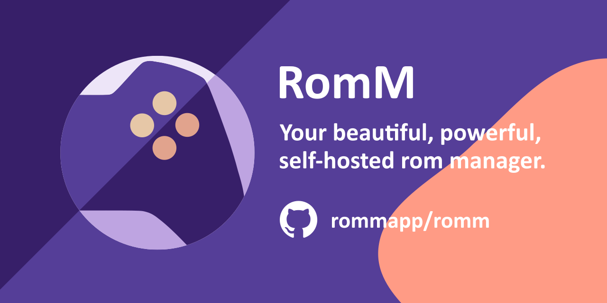
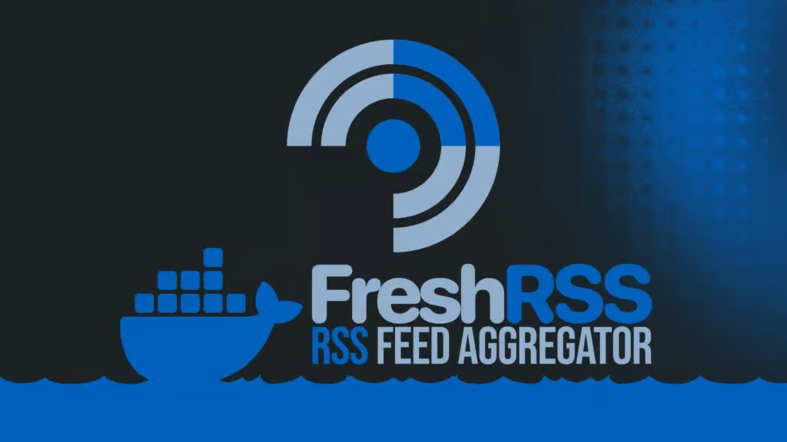

# Official degoog extensions

---

Plugins

### Weather

Shows weather information using Open-Meteo. Command plugin: run it to get current conditions for a location.

Screenshot

### Define

Look up word definitions using the Free Dictionary API. Command: type a word to get definitions, phonetics, and example usage.

Screenshot

### Time

Show current time in a timezone or city. Command plugin that displays the time for the given place or timezone.

Screenshot

### QR Code

Generate a QR code for a URL. Command: pass a URL to get a scannable QR code.

Screenshot

### Password

Generate a random password. Command plugin that creates a secure random password on demand.

Screenshot

### Search history

Stores search history in `data/history.json` with timestamps. Use `!history` to see a paginated, deletable list of past searches.

Screenshot

### TMDb

Shows movie and TV show details above search results. Slot plugin: when results include TMDb links, it displays poster, rating, and summary in a card above the results.

Screenshot

### Math

Evaluates math expressions and shows the result above search results. Slot plugin: type an expression in the search bar to get the computed result in a slot.

Screenshot

### Jellyfin

Search your Jellyfin media library. Command plugin: query your Jellyfin server for movies, shows, and other media.

Screenshot

### RomM

Search your RomM game library. Command plugin: query your RomM instance for games by title, with cover art in the results.

Screenshot

### Colors

Generate a five-color palette. Command: `!colors` for a random palette, or pass color names or hex values (e.g. `!colors orange red yellow`) to fill swatches from left to right and shuffle them with your space bar.

Screenshot

### Meilisearch

Search across your Meilisearch indexes. Command plugin: run searches against your Meilisearch instance from the search bar.

Screenshot

### Home RSS Feeds

Shows RSS feed items above search results. Slot plugin: configured feeds are displayed in a slot on the home/search page.

Screenshot

### FreshRSS

Integrates a self-hosted FreshRSS instance. Streams your aggregated feed on the home page and lets you search it as a bang command (`!freshrss` / `!frss`). Supports category filtering and unread-only mode. Requires the API to be enabled in your FreshRSS profile — see the plugin README for setup steps.

Screenshot

### GitHub

When search results include GitHub repos or users, shows styled info above results. Slot plugin that renders GitHub cards (repo stats, user info) in a slot.

Screenshot

### Apps pocket

Adds a Google-style apps grid next to the settings icon. Apps are customised via the Configure button as a JSON list.

Screenshot

### Spell Check

Intercepts search queries and corrects spelling using [LanguageTool](https://languagetool.org). Point it at a self-hosted instance for full privacy — the public API works out of the box with no key required. Supports all languages LanguageTool supports. Single-word queries are skipped to avoid false positives.

Screenshot

### DuckDuckGo bang redirect

Type `!!` followed by any DuckDuckGo bang command to trigger them directly from degoog. This will route through DuckDuckGo.

### Highlight Terms

Automatically wraps query-matching words in `<strong>` on result titles and snippets on every search page. No configuration needed — install and it works. Use `!highlight` to confirm it is active.

Screenshot

### File tab results

Adds a Files tab to search results that finds downloadable files via file-type engines.

---

Themes

### Degoog Docs

A theme that matches the degoog documentation site.

### Zen

A minimalist calming theme. Overrides the default degoog look with a simple, low-noise layout and colors.

Screenshot

### Catppuccin

Catppuccin palette: Mocha (blue), Latte (light blue), Rose (red/coral), Peach (orange/amber). Multiple flavor options.

Screenshot

### Pokemon

Starter-inspired color schemes: Pikachu (yellow), Bulbasaur (green), Charmander (orange), Squirtle (blue).

Screenshot

---

Transports

### FlareSolverr

Bypass Cloudflare challenges via a [FlareSolverr](https://github.com/FlareSolverr/FlareSolverr) instance. Once configured, engines can select "flaresolverr" as their outgoing transport. Requires a running FlareSolverr instance.

Screenshot

### Browserless

Fetches pages through a self-hosted Browserless instance (or any compatible headless browser service). Renders JavaScript before returning HTML — useful for engines like Google Images that block standard HTTP requests. Compatible with browserless/chromium, CloakBrowser wrappers, and any service exposing `POST /content`.

Screenshot

### CloakBrowser

Fetches pages through a self-hosted CloakBrowser service (stealth Chromium). Patches bot-detection signals at the C++ level — `navigator.webdriver`, canvas, CDP leaks — bypassing Google and Cloudflare. See homelab/cloakbrowser for the Docker service.

Screenshot

### Camoufox

Fetches pages through a self-hosted Camoufox service (stealth Firefox). Patches bot-detection signals at the C++ level, bypassing Google and Cloudflare. See [Korosys/camoufox-degoog](https://github.com/Korosys/camoufox-degoog) for the Docker service.

Screenshot

### degoog-4play

Uses a browser extension to harvest a genuine session for each target host, then passes those cookies to curl-impersonate for outgoing requests.

---

Engines

### DuckDuckGo Images

Adds the very powerful DDG images search engine to degoog, adding an extra ~70 images per page to the image results.

Screenshot

### Ecosia

Adds the Ecosia search engine to degoog. Ecosia may return no results when Cloudflare blocks server-side requests; use another engine if that happens.

Screenshot

### Startpage

Adds the Startpage engine to degoog. You can enable Anonymous View so result links open via Startpage's proxy.

Screenshot

### Internet Archive

Adds the Internet Archive as a file-type engine. Searches archive.org for downloadable files, books, software, and media.

Screenshot

### Brave API Search

Adds the Brave Search API as a web engine. Requires a free API key from brave.com/search/api (2,000 queries/month on the free tier).

Screenshot

### Openverse

Adds the Openverse image engine to degoog. Searches CC-licensed images aggregated from Flickr, Wikimedia and museum collections via the public Openverse API. No API key required.

Screenshot

### Wikimedia Commons

Adds the Wikimedia Commons image engine to degoog. Searches the Wikimedia Commons media archive via the MediaWiki API. No API key required.

Screenshot

### NASA Images

Adds the NASA image engine to degoog. Searches the NASA Image and Video Library. No API key required.

Screenshot

### Hacker News

Adds the Hacker News engine to degoog. Searches Hacker News stories via the Algolia API. No API key required.

Screenshot

### DuckDuckGo News

Adds the DuckDuckGo News engine to degoog. No API key required.

Screenshot

### The Guardian

Adds The Guardian as a news engine via the Guardian Open Platform API. Requires a free API key from open-platform.theguardian.com.

Screenshot

---

Autocomplete

### Brave

Autocomplete suggestions from Brave Search. Works without an API key; optionally add your Brave Search API key for authenticated requests.

### Bing

Autocomplete suggestions from Bing. No API key required.

### Yahoo

Autocomplete suggestions from Yahoo Search. No API key required.

